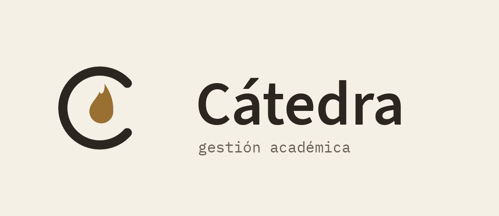
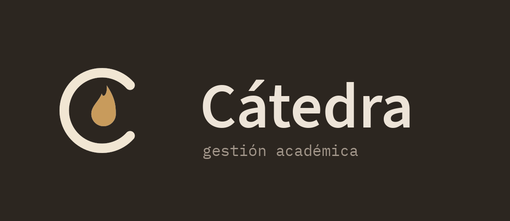
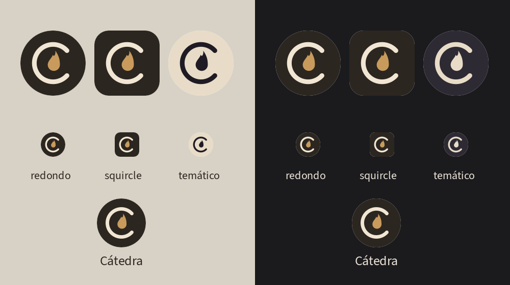

# Logo de Cátedra

## Concepto: la C que guarda la llama

Una **C** abierta a la derecha que sostiene la **llama de la lucerna** de
Diógenes (la que lleva Erizógenes). La C es la inicial y a la vez el cuenco
de la lámpara: la cátedra guarda la luz. Es el concepto `2-c-lampara-elegido`.

### Por qué este y no los otros (`conceptos/`, hoja en `conceptos/hoja-conceptos.png`)

| Concepto | Qué pasó |
|---|---|
| 1 · capitel jónico con llama | El más «griego», pero a 48 px las volutas se leen como ojos y el fuste como dientes o como una Π. Demasiado detalle para un ícono. |
| **2 · C con la llama dentro** | **Elegido.** Se lee a 48 px y en monocromo, es propio (inicial + lucerna), y su anillo es el mismo que el de Kairós, así que las dos apps quedan como familia. |
| 3 · C-lucerna con pico | La C se alarga en el pico de la lámpara; pierde la C y se desbalancea. |
| 4 · llama en el remate de la C | La llama parece un signo añadido; el conjunto queda torcido. |
| 5 · erizo-lámpara | Se lee como un sol que sale, no como erizo, y choca con los temas de Kairós. |

## Construcción

- Rejilla de **108** unidades (la del ícono adaptativo de Android), centro (54,54).
- Anillo de **radio 24**, **trazo 6**, remates redondos, abierto **±42°** a la derecha.
- Llama: gota asimétrica de 26 de alto y 15,6 de ancho, con la punta vencida a la
  derecha y una muesca a la izquierda (el parpadeo); su base está en (55, 64).
- En el lanzador el símbolo se reduce a **0,86** (≈52 dp de los 72 visibles,
  dentro de la zona segura de 66 dp).
- Kairós usa **el mismo anillo, el mismo trazo y la misma escala**; cambia la
  apertura y lo que va dentro (manecillas en vez de llama).

## Colores

| Uso | Oscuro (lanzador) | Claro (papel) |
|---|---|---|
| Fondo | tinta `#2C2620` | papel `#F5F0E6` |
| C | hueso `#F1E6D3` | tinta `#2C2620` |
| Llama | ocre `accent.primary` `#C89B5C` | ocre `#9A6F32` |

Monocromo (`logo-mono.svg`, capa temática de Android 13 e ícono de
notificación): todo en un solo color; la llama queda como silueta llena.

## Archivos

- `logo.svg` — ícono con fondo (squircle). `logo-transparente.svg` — símbolo sin fondo, colores claros. `logo-mono.svg` — un color.
- `preview-claro.png`, `preview-oscuro.png`, `preview-lanzador.png`.
- `generar.py` — genera todo lo anterior y los recursos Android:
  `drawable/ic_launcher_foreground.xml`, `drawable/ic_launcher_monochrome.xml`,
  `mipmap-anydpi-v26/ic_launcher{,_round}.xml`, `values/ic_launcher_colors.xml`,
  `mipmap-*/ic_launcher{,_round}.png` y `drawable/ic_stat_catedra.xml`.
  Uso: `python3 design/logo/generar.py` desde la raíz (necesita `rsvg-convert` y Pillow).
